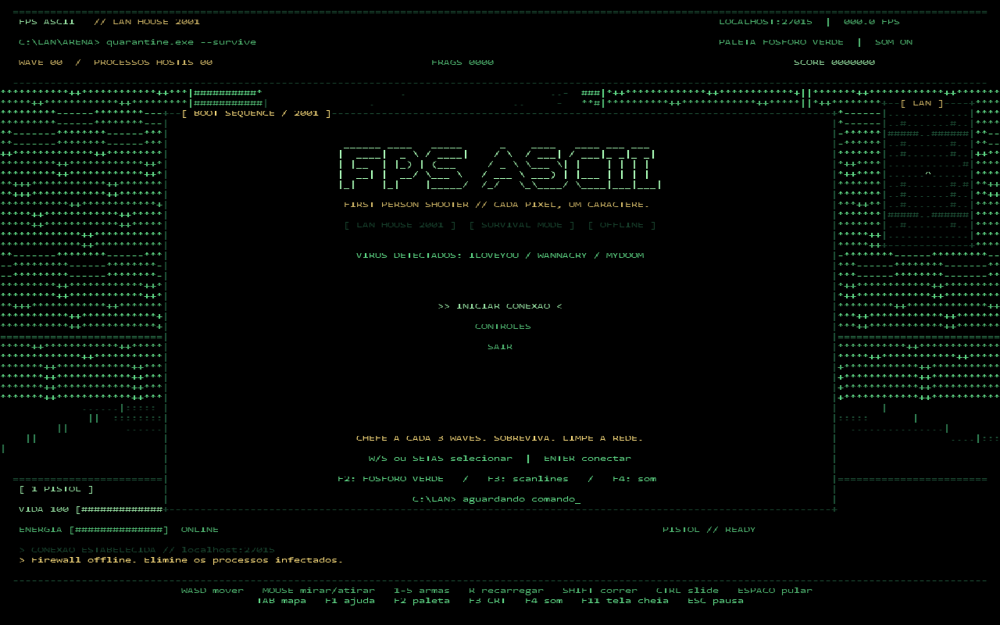

<div align="center">

# FPS ASCII
### FPS de sobrevivência com renderização ASCII

Sobreviva a uma LAN house de 2001 enquanto enfrenta ameaças digitais em um mundo renderizado com caracteres.


<br>



<br>

</div>

---

## Sobre o projeto

O **FPS ASCII** é um jogo de tiro em primeira pessoa desenvolvido em Python utilizando `pygame-ce`.

O jogo é ambientado em uma LAN house no ano de **2001** e possui uma estética inspirada em terminais e computadores antigos.

O cenário é construído utilizando caracteres ASCII e a perspectiva em primeira pessoa é gerada através de um sistema de **raycasting DDA**.

O jogador precisa sobreviver a diferentes ondas de inimigos, administrar vida, energia, munição e utilizar diferentes armas para continuar avançando.

---

## Como funciona

A partida é baseada em ondas progressivas:

```text
EXPLORAÇÃO → COMBATE → NOVA ONDA → BOSS
```

A cada nova onda:

- Mais inimigos aparecem;
- Os inimigos ficam mais resistentes;
- A dificuldade aumenta;
- Novos desafios são apresentados;
- Chefes surgem periodicamente.

O objetivo é sobreviver pelo maior número possível de ondas.

---

## Renderização ASCII

O jogo não utiliza sprites tradicionais para construir o cenário.

A visão em primeira pessoa é gerada através de **raycasting**, calculando a distância entre o jogador e as paredes do mapa.

```text
PLAYER
   \
    \
     \
      \
       █
       █
       █
       █
```

A distância encontrada por cada raio determina a altura da parede exibida na tela.

O sistema também utiliza informações de profundidade para impedir que inimigos sejam renderizados através de paredes.

---

## Inimigos

### ILOVEYOU

Inimigo focado em perseguição e ataques próximos ao jogador.

### WannaCry

Pode criar novas ameaças durante o combate, aumentando a pressão durante as ondas.

### Mydoom

Possui ataques à distância utilizando projéteis.

### Boss

Chefes especiais aparecem durante a progressão e possuem:

- Mais vida;
- Maior resistência;
- Ataques próprios;
- Maior dificuldade.

---

## Armas

O jogador possui diferentes opções de combate:

```text
1 → Pistol
2 → Rifle
3 → Shotgun
4 → Sniper
5 → Sword
```

Cada arma possui características diferentes de:

- Dano;
- Alcance;
- Cadência;
- Quantidade de munição;
- Tempo de recarga.

A espada permite ataques corpo a corpo sem consumir munição.

---

## Movimentação

Além da movimentação tradicional de FPS, o jogador pode:

- Correr;
- Pular;
- Agachar;
- Realizar slide;
- Controlar a direção utilizando o mouse;
- Utilizar energia durante determinadas ações.

---

## Principais funcionalidades

- FPS em primeira pessoa;
- Renderização utilizando caracteres ASCII;
- Raycasting DDA;
- Sistema de profundidade;
- Diferentes tipos de inimigos;
- IA de perseguição;
- Ataques à distância;
- Sistema progressivo de ondas;
- Chefes;
- Sistema de vida;
- Sistema de energia;
- Corrida;
- Pulo;
- Agachamento;
- Slide;
- Diferentes armas;
- Sistema de munição;
- Recarga;
- Minimap;
- HUD;
- Paletas de cores;
- Scanlines;
- Efeitos sonoros;
- Menus;
- Sistema de pausa;
- Tela cheia;
- Modo headless;
- Modo de demonstração;
- Testes automatizados.

---

## Controles

| Ação | Controle |
|---|---|
| Movimento | `W A S D` |
| Olhar | `Mouse` |
| Girar | `← →` |
| Olhar verticalmente | `Page Up / Page Down` |
| Atirar | `Mouse esquerdo / F` |
| Mira da Sniper | `Mouse direito / Q` |
| Trocar arma | `1 - 5 / Scroll` |
| Recarregar | `R` |
| Correr | `Shift` |
| Pular | `Espaço` |
| Agachar / Slide | `Ctrl / C` |
| Mapa | `Tab` |
| Pausar | `Esc` |
| Ajuda | `F1` |
| Paleta | `F2` |
| Scanlines | `F3` |
| Som | `F4` |
| Tela cheia | `F11` |

---

## Tecnologias utilizadas

<div align="center">


</div>

### Desenvolvimento

- Python;
- pygame-ce;
- Programação Orientada a Objetos.

### Engine

- Raycasting DDA;
- Buffer ASCII;
- Controle de profundidade;
- Colisões;
- Navegação em mapas.

### Qualidade

- Testes automatizados;
- Git;
- GitHub.

---

## Estrutura do projeto

```text
FPS/
│
├── fps_ascii/
│   │
│   ├── engine/
│   │   ├── buffer.py
│   │   └── raycaster.py
│   │
│   ├── ui/
│   │   └── hud.py
│   │
│   ├── __main__.py
│   ├── app.py
│   ├── audio.py
│   ├── enemies.py
│   ├── game.py
│   ├── maps.py
│   ├── player.py
│   ├── weapons.py
│   └── waves.py
│
├── tests/
├── docs/
│
├── jogar.py
├── iniciar_fps.bat
├── requirements.txt
└── README.md
```

### Responsabilidade dos arquivos

- `app.py`: janela, eventos, menus e loop principal;
- `game.py`: controle e integração da partida;
- `player.py`: movimentação, vida, energia e colisões;
- `weapons.py`: armas, munição, disparos e recarga;
- `enemies.py`: inimigos, IA e ataques;
- `waves.py`: progressão das ondas;
- `maps.py`: estrutura e navegação dos mapas;
- `engine/raycaster.py`: raycasting e projeção do cenário;
- `engine/buffer.py`: buffer e renderização ASCII;
- `ui/hud.py`: HUD, minimapa e interface;
- `audio.py`: efeitos sonoros;
- `tests/`: testes automatizados.

---

## Como executar

### 1. Clone o repositório

```bash
git clone https://github.com/DutraBrun0/FPS.git
cd FPS
```

### 2. Crie o ambiente virtual

```bash
python -m venv .venv
```

### 3. Ative o ambiente virtual

No Windows:

```bash
.venv\Scripts\activate
```

No Linux ou macOS:

```bash
source .venv/bin/activate
```

### 4. Instale as dependências

```bash
pip install -r requirements.txt
```

### 5. Inicie o jogo

```bash
python -m fps_ascii
```

Também é possível executar:

```bash
python jogar.py
```

No Windows:

```text
iniciar_fps.bat
```

---

## Configurações

Executar utilizando outra paleta:

```bash
python -m fps_ascii --palette amber
```

Executar sem áudio:

```bash
python -m fps_ascii --no-audio
```

Alterar resolução:

```bash
python -m fps_ascii --size 1440x900
```

---

## Testes automatizados

Para executar os testes:

```bash
python -B -m unittest discover -s tests -v
```

O projeto também possui um modo **headless**, permitindo executar a simulação sem abrir a janela:

```bash
python -B -m fps_ascii --headless --demo --frames 360 --no-audio
```

Para gerar uma imagem de demonstração:

```bash
python -B -m fps_ascii --headless --demo --frames 180 --screenshot docs/demo.png
```

---

## Objetivo

Este projeto foi desenvolvido para praticar:

- Organização de projetos Python;
- Programação Orientada a Objetos;
- Matemática aplicada a jogos;
- Raycasting;
- Trigonometria;
- Game loops;
- Controle de tempo;
- Colisões;
- Inteligência artificial;
- Gerenciamento de estados;
- Testes;
- Git e GitHub.

---

## Desenvolvimento com auxílio de IA

O projeto foi desenvolvido por **Bruno Dutra com auxílio do OpenAI Codex**.

O Codex foi utilizado como ferramenta de apoio durante partes do processo de implementação, revisão, organização e depuração do código.

O desenvolvimento do projeto também foi utilizado como forma de estudo e prática dos conceitos implementados.

---

## Autor

Desenvolvido por **Bruno Dutra**.

[GitHub](https://github.com/DutraBrun0) • [LinkedIn](https://www.linkedin.com/in/brunodutraaa/)

---

<div align="center">

**FPS ASCII — sobreviva à LAN house de 2001.**

</div>